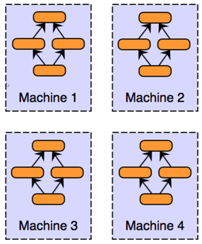
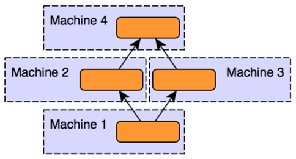
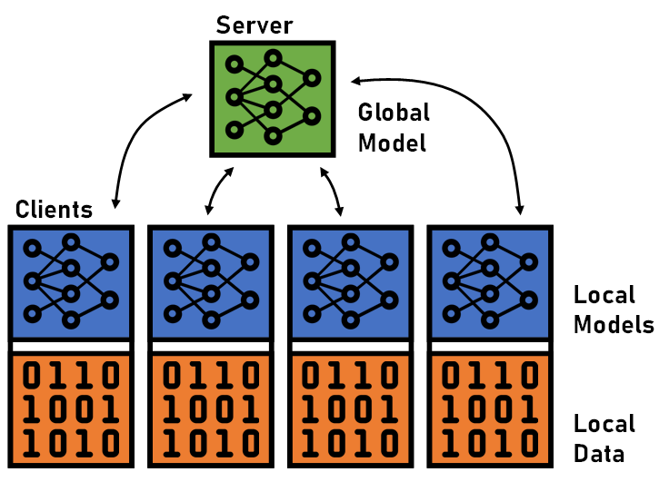
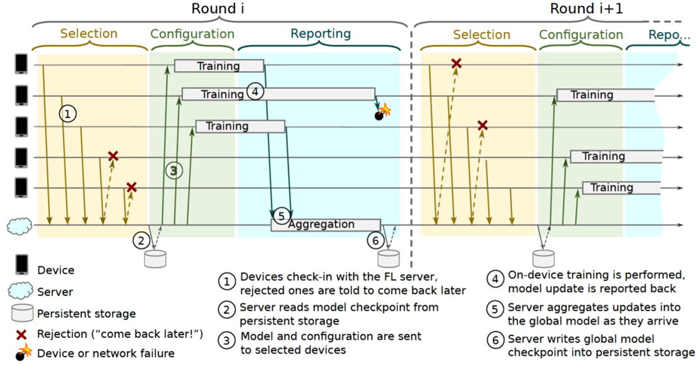
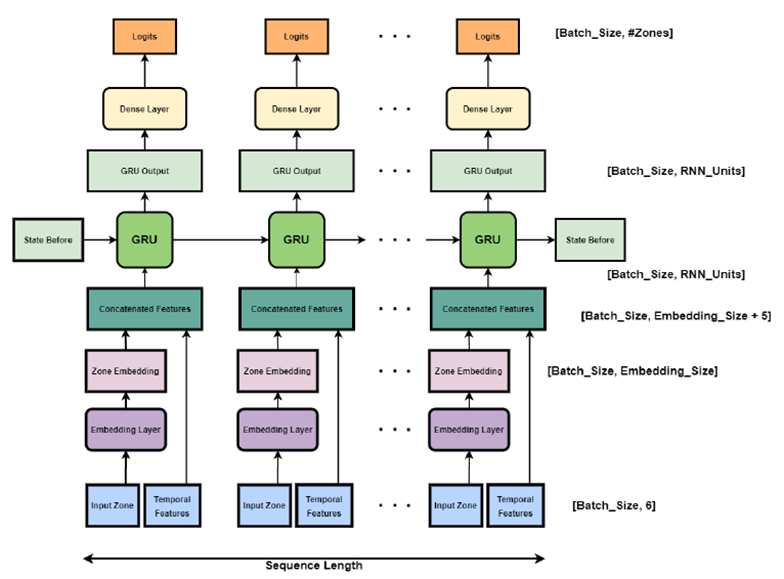
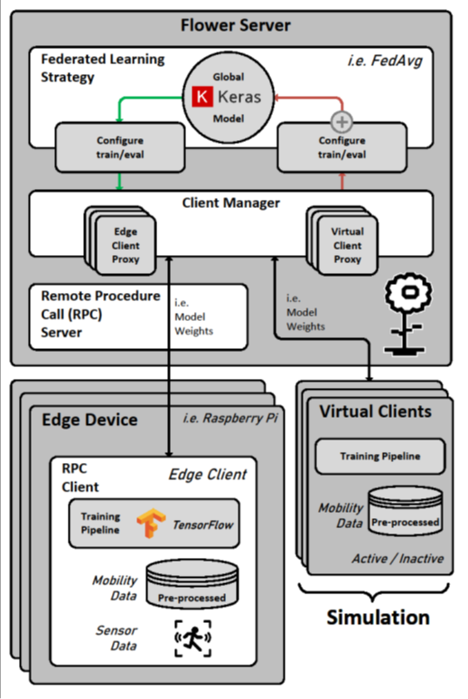
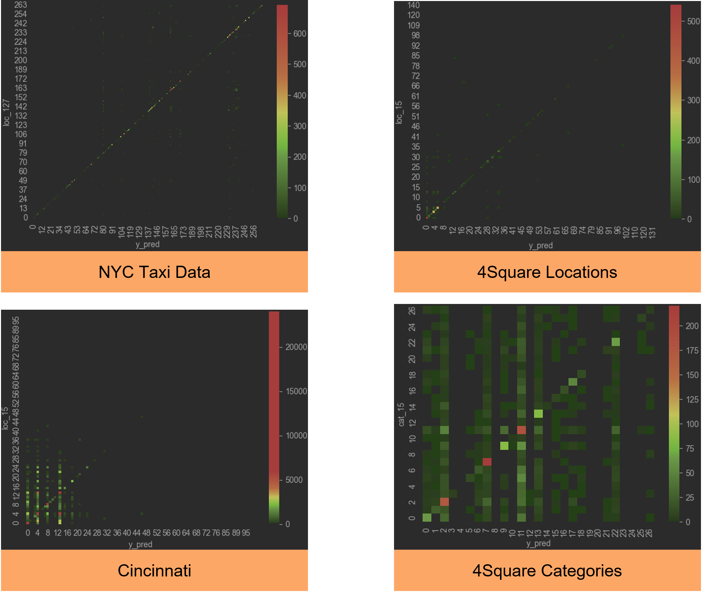

# Distributed Machine Learning for IoT
Distributed Machine Learning involves training and evaluating machine learning models distributed 
across multiple devices connected via a network.
It finds application when dealing with or when in need of:
- Big Data 
- Highly complex models
- Time-critical models
- Data security (differential privacy)
- Fault tolerance

One can distinguish between data parallelism and model parallelism.

In data parallelism, the training data is partitioned and distributed.
Local models are trained and then 
merged into a central model.

In model parallelism, the models are partitioned and distributed. 
Segments of the models are trained on local data. 
The segments then form an overall model that is distributed across the individual machines.

Federated learning can be understood as a hybrid between data and model parallelism. 

It is the most common application of distributed machine learning.
It employs on-device training, i.e., clients train local models on the available data.
In addition, a central model is used to achieve synchronization of the local models.
Federated Learning is particularly suitable when decentralized processing is important and
data security (privacy) is a priority.

The Central Model is more for synchronization. Therefore, one can speak of a hybrid form between data and model parallelism.

The server executes the training in rounds.
In each round, local training takes place on the clients. 
In Federated Learning not all clients have to be used in every server training round. 
Within a selection phase the clients can be chosen for training.

As a first step, the server reads in a global model (e.g. from a checkpoint in the persistent storage). 
It sets the weights and 
sends them as parameters to the selected clients. 
This sending of weights is done at the beginning of each server round to keep the clients up to date.

Then the on-device training is executed on the local data.
The clients train their local models.
During this process, it can always happen that clients fail (especially for edge devices or in the IoT domain). 
However, this is not a problem.

The aggregation of the data is done via a weighted avg (e.g. FedAvg). 
Here, all data from clients that have reported their calculated weights of the trained models are integrated.

The server then recalculates a global model and persists it if necessary. 

This is followed by the repetition of the steps until a convergence or a desired accuracy or is reached or even a number of server epochs are over. 

Local models therefore differ from global model.
The global model should achieve however with convergence nearly same performance on all clients (under optimal conditions).

Federated Learning can use various algorithms.
Deep learning is particularly suitable, as it is very similar in its areas of application. These include:
- speech recognition
- human mobility modeling
- natural language processing
- time series data
- many more

For the project, deep learning was used in combination with federated learning to predict human mobility data. 
Deep learning itself has several subcategories. The best known are the feed forward networks. 
As the name suggests, data is transported in one direction through the network. 
It is often used in regression or classification problems. 
The recurrent neural networks process sequential data, such as time series data or natural language. 
They allow information from previous inputs to be reused later by memory cells. 
Examples include the long short term memory (LSTM) and the gated recurrent units (GRU) networks.

## The Project
The project is a Case Study on Distributed Machine Learning for IoT.
Distributed Machine Learning combines two modern fields of research in computer science, 
namely distributed systems and machine learning. 
In recent years, a lot of new knowledge has been gained in this area and numerous frameworks have emerged. 
However, it is unclear how far research has progressed here and whether the solutions can already be used in a practical way.
A Review of Related Work took place, where the main goal was to evaluate the practical use cases.
A central use case is Human Mobility Prediction.
There is a lot of interesting work in this area.

The work is based on a project called ["Federated Learning for Human Mobility Models"](https://github.com/alexcaselli/Federated-Learning-for-Human-Mobility-Models), 
which was developed in the context of a master thesis. 
The project evaluates the use of federated learning for next place prediction. 
Three different datasets are used. An extensive preprocessing of the data is performed. 
Subsequently, different model architectures as well as configurations and settings of federated learning are evaluated. 
A comparison with the central training approach is also performed.

Various limitations and open points were noted. These are of interest to the project because they offer opportunities for linkage. 

The limitations include:
- Long training times
- Quality of the dataset
- Limited choice of metrics
- Application of differential privacy

Possible future work includes:
- Intelligent domain partitioning
- Secure aggregation
- Federated learning in practice
- Attacks on federated learning

The project was carried out in the following steps:
- familiarization with the underlying work, as well as used and alternative technologies
- Review of other datasets
- Evaluation of semantic location prediction, comparison with physical prediction
- Testing of alternative model architectures
- Practical applicability (usable frameworks)

## Functional-Requirements: 
### Must-Have-Requirements:
- Pre-processing of datasets
- Distributed learning to predict next locations based on a history of visited locations
- Evaluation of prediction results with preceding insights

### Should-Have-Requirements
- Performing a physical test run with distributed data

### Nice-To-Have-Requirements
- Evaluation logic for in-depth recalculations of the model's weights
- Use precompiled model to reduce training time

## Non-Functional-Requirements:
### Must-Have-Requirements
- Using the Foursquare dataset
- Using the Raspberry Pis as clients
- Apply Federated Learning 
- Python accordingly as programming language

### Should-Have-Requirements
Performance / training time should not overload the Pis (framework)

## Generalized Approach
In general, a deep analysis of the underlying work as well as other Related Work was necessary. 
technical familiarization with the different frameworks had to be done as well. 
Tensorflow should be used for the central models. 
Tensorflow Federated (TFF) should be used as a framework to simulate federated learning models.
For the practical evaluation Flower will be used to run Federated Learning on Raspberry Pis. 
TFF does not provide this functionality. 
In the versions of TFF available at the time of the project work, only simulations on a terminal device are possible.

The project implementation process is then broken down into steps as follows:
- Data Processing
  - Outlier Removal
  - Feature Engineering
  - Data transformations
- Central Models
  - Create Baseline
  - Evaluate network architectures
  - Compare datasets
- TFF Models
  - Enable Comparison Related Work
  - Create comparison baseline for Federated Learning with Flower
- Flower Model 
  - Determine practical feasibility
  - Analyze functional scope

## Datasets
Four different datasets were used in the project work. These are briefly described below:

- NYC Taxi Data: 
It contains a lot of data about cab rides in NYC. These are listed so that they have a start and end location.
It was used in the original work, but does not satisfy extensively (see limitations).
[[Download]](https://www.nyc.gov/site/tlc/about/tlc-trip-record-data.page)

- Gowalla:
It was sighted as an alternative at the beginning. 
The analysis showed that it contains too few data points on too high a number of different locations.
It was also not comprehensively clear what the locations represented. 
The documentation of the dataset does not explain what the IDs stand for. 
Accordingly, mapping is difficult to determine.
[[Download]](https://snap.stanford.edu/data/loc-gowalla.html)

- 4Square:
The 4Square dataset turned out to be a better alternative.
It contains voluntary user checkins about devices at locations, which were collected over a longer period of time.
It also has enough metadata to make semantic predictions about locations.
This includes information about location categories beyond location types. 
[[Download]](https://sites.google.com/site/yangdingqi/home/foursquare-dataset)

- Cincinnati:
The Cincinnati Public Service Vehicle dataset was added later in the process.
It is a very large dataset with a lot of metadata.
It includes trips made by Public Service Vehicles (road vehicles).
Thus, it has the highest probability of patterns, since road vehicles usually travel the same routes. 
[[Download]](https://data.cincinnati-oh.gov/Thriving-Neighborhoods/Historic-Vehicle-GPS-Data-Department-of-Public-Ser/jmaw-gcgj)

## Pre-Processing
The preprocessing includes three major steps. These are performed both in advance and immediately before and during training of the data.
- Analysis includes:
  - Examine individual datasets for number of different locations, users/vehicles
  - Check for incorrect data, outliers
- Data transformations, such as:
  - Sin-Cos transformation for cyclic time data, which was previously decomposed into components to gain more insight (time, day, month, weekend)
  - Creation of unique IDs, i.e. for categories: custom uber categories were created for the semantic prediction (e.g. Restaurant, Shopping, Entertainment, Culture)
  - Encoding, primarily one-hot encoding for IDs, thus the neural network learns that there is no relation between the numbers
  - Embedding, as N-dimensional vector (lookup table for IDs), includes float values learned in training and keeps relations between the ids
- Dataset transformations:
  - Creation of sequences of N data points (history for prediction) by
    - taking chunks of length N
    - windowing (alternative method, where the data series overlap, degree of overlap depending on sequence stride value)
  - Feature selection, selection of the data for the training of the respective model

## Model architectures
The original model makes a prediction as follows:
1. Prediction for each element of the sequence based on location and time (concat layer).
2. GRU takes into account the data of the previous sequence (states kept in memory cells)
3. Output via Softmax (classification of the location)

This architecture was found to yield the best performance:

Various changes to the model architecture were tested. These are listed below:

- Modified Prediction Output:
  - only one target location (i.)

The prediction of only one target location works just as well, but better suited for practical application.
Additionally, the training is executed much faster, thus saving time.

- Modified Input Features:
  - location sequences only (ii.)
  - only Time Components (iii.)
  - location sequence + end time (iv.)
  - location sequence + start time sequence + end time (v.)

For the NYC taxi data and Foursquare locations, 
it was generally found that the time components have marginal effects on the predictions.
Reasons for this are that the physical areas are too large and therefore no pattern can be found. 
This should be more useful for semantic prediction when data has more structure 
(e.g. to some degree for the cincinnati dataset).

It is expected that applies:
- Best prediction accuracy (v.)
- Low complexity (ii.)
- Best balance between performance and complexity (iv.)

## Flower architecture
The flower architecture can be seen below:

Flower further provides the following functionalities:
- Dynamic Clients 
  - Dropouts
- Strategies (e.g. FedAvg)
- Checkpointing
- Security 
  - Encryption
  - Differential Privacy
  - Secure Aggregation
- Central Evaluation
  - For faster convergence
  - Solution for the Cold Start Problem
  - Anomaly detection
- Simulations

More information can be found on the [Flower GitHub](https://github.com/adap/flower) or in the referenced user documentation.

## Evaluation
New feature called "tf.keras.experimental.SequenceFeatures" allows neural networks to process sequential data much better,
more effectively. 
It leads to a strong performance increase compared to the traditional InputFeatures (InputLayer / DenseFeatures), 
as long as the data is delivered to the network in sequenced form.
Sequencing (Chunks/Windows) should therefore always be combined with the SequenceFeatures 
and the corresponding SequenceLayers.

Tests with too homogeneous data as well as small DataSets always showed low prediction accuracies.
Tests on single or few clients at NYC / FourSquare as well as tests on small datasets for faster execution 
(e.g. finding feature subsets) delivered unsatisfactory performance. 
A threshold of 10^6 data sets was found to be acceptable performance.

The test with the Raspberry Pis was executed on the Cincinnati dataset.
This dataset was chosen because it has the most data and can therefore be partitioned well. 
In addition, the individual vehicles have the most patterns (routes) here.
The Partitioning and preparation of the data was executed.
Every client received a subset of the dataset that only contained data points of one asset (service vehicle).
The test showed that no smaller model has to be compiled for the Pis.
Despite having limited hardware, they can run a rather complex model.
Nonetheless, the execution was relatively time-consuming
With around 440,000 rows of training data, 
the training of the centralized model only took 5 minutes and 12 seconds on commercial hardware.
That means one epoch takes roughly 20 seconds.
For the federated model the duration of epochs varied between 160 (minimum) and 230 (maximum) seconds.
The total duration summed up to 48 minutes and 32secs.
That is a vast increase in duration but still feasible.
In a practical scenario each training round would be much smaller and could be executed when devices are idle for example. 
 
The performance turned out to be only slightly worse than the central model. 
The sparse categorical accuracy was used as the metric for the comparison.
After 15 epochs the centralized model reached an accuracy of 0.1288 for the two vehicles used.
The federated model executed 15 server rounds and reached an accuracy of 0.1248.

The analysis of the predictions has shown that the neural networks in the original work mostly predicts only the last location in the history as the next location. This peculiarity was also investigated for the now newly tested data sets.

The results showed that when predicting locations on the 4Square dataset, the prediction of the last area (location 15 on 16 sequence) as the next area was also found to be the best achievable accuracy (~30%). 

In Cincinnati, however, some patterns are learned but the prediction of the last area still remains recognizable in some cases.
This would probably decrease with finer-granular area subdivision (see Outlook).

With semantic prediction, this pattern is still easily recognizable (due to coarse uber categories, like restaurants or shopping).

